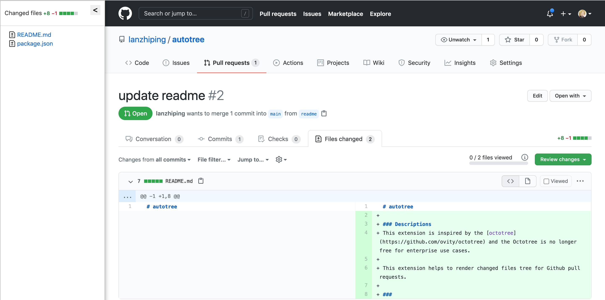

# autotree

### Descriptions
This extension is inspired by the [octotree](https://github.com/ovity/octotree) and the Octotree is no longer free for enterprise use cases.

This extension helps to render changed files tree for Github pull requests.

###

